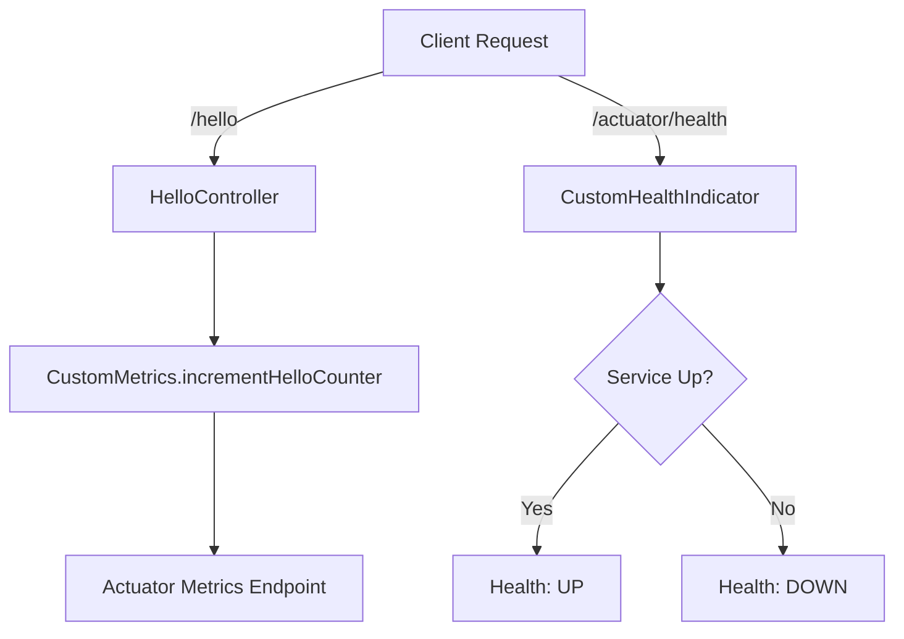

# 📊 Spring Actuator Custom Demo

Projeto de demonstração do Spring Boot Actuator com métricas customizadas e health indicators personalizados.
Esse projeto complementa o aprendizado da Seção 6.3 da certificação Spring.

## 📌 Funcionalidades

- Configuração do Spring Boot Actuator
- Endpoints básicos de monitoramento (/actuator/health, /actuator/info, /actuator/metrics)
- Métrica personalizada (custom.hello.counter)
- Health indicator customizado (CustomService)
- Endpoint REST simples /hello

## 📂 Estrutura do Projeto

```bash
spring-actuator-custom-demo/
 ├── build.gradle.kts
 ├── settings.gradle.kts
 └── src
     ├── main
     │   ├── java/com/example/actuatorcustom
     │   │   ├── SpringActuatorCustomDemoApplication.java
     │   │   ├── controller/HelloController.java
     │   │   ├── metrics/CustomMetrics.java
     │   │   └── health/CustomHealthIndicator.java
     │   └── resources/application.properties
     └── test/java/com/example/actuatorcustom
         └── SpringActuatorCustomDemoApplicationTests.java

```

## ▶️ Como Executar

```bash

# Clonar repositório
git clone link do repositorio

# Rodar aplicação
./gradlew bootRun

```

## 📊 Fluxo do Projeto 



---

**Kleber Vales**  

*Back-end Software Developer*  


